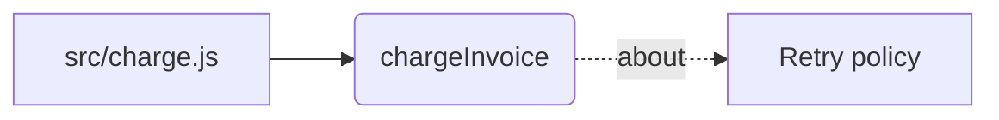

# Using the memory layer

Code says what runs. It does not say why. A function that retries twice is
readable; that a third retry existed and was removed because the payment gateway
counted it as a fresh authorisation is not in the code, and never will be.

> Tiếng Việt: [usage_vn.md](usage_vn.md)

That is what this stores, and everything below follows from it.

---

## The whole flow, once

```
install the plugin
        │
        ▼
dai-memory init ──────────────────────────────────────────┐
        │  creates .memory/                          │
        │  probes what this platform can do          │  one command
        │  scans the whole repository tree           │
        │  builds the code graph (files → symbols)   │
        │  writes .memory/ui.html                    │
        ▼                                             ┘
open .memory/ui.html          ← the graph, the store, the health report
        │
        ▼
work ── the plugin reads on its own:
        │   session start      → constraints and unresolved conflicts
        │   before Read/Grep   → what memory knows about that file
        │   before git commit  → what the staged diff touches
        ▼
dai-memory write ────────────── a decision, by hand, with the reason
        │
        ▼
dai-memory ingest ───────────── after files change (put it in post-commit)
        │  no paths: the whole repository tree
        │  replaces what those files produced before
        │  reclaims files that are no longer on disk
        │  rewrites ui.html
        ▼
dai-memory prune ────────────── occasionally: old episodic notes nothing points at
```

Two things are automatic and two are not, and the split is deliberate.

**Reading is automatic.** Hooks load context at session start, before a file is
read, and before a commit. Nothing to remember.

**Indexing is derived data**, so letting it run itself is safe — the files are
the truth, re-indexing is idempotent, and the only failure is falling behind.
Put `dai-memory ingest` in `post-commit`.

**Writing a decision is a judgement**, so it stays in your hands. The reason a
choice was made over the alternative is the part no machine can infer, and it is
the only part worth storing.

**Forgetting is a judgement too.** `dai-memory prune` removes only old episodic notes
that nothing points at, and it will not touch a decision however old it gets.

---

## Setup, once per project

```bash
dai-memory init
```

Creates the store in `.memory/`, scans **the whole repository tree**, probes
what this platform can actually do, and prints the result.

It does not guess which directories matter. It used to: conventional names
(`docs/`, `src/`…) plus anything that looked like a project. Measured on a real
C# repository, that rule skipped `openspec/` with 408 markdown files, and
`wiki/` and `human-only/` with it, because none of those names were on any
list. The more carefully a tree is organised, the more wrong a guess gets.

The guess only ever existed to keep vendored code and build output out, and the
walk now does that itself, by rule and at any depth: dependency and build
directories, secrets, lockfiles, binaries, `.memignore` -- each skip reported
with its reason. With those in place the root is the right target.

Dot-directories are skipped, except the ones that hold the project's own
configuration: `.github`, `.gitlab`, `.husky`, `.circleci`, `.devcontainer`,
and `.claude`, where a team keeps its agents, commands and skills --
architectural conventions like `arch-module`, written down and committed.
`.vscode` and `.idea` stay out as one developer's editor, and so does
`.claude/settings.local.json`. Claude's automatic memory lives in the home
directory, outside every repository, and the walk never reaches it.

The result: Read that output — it is the only place that tells you
whether semantic search is real or a fallback:

```
graph              ok      ladybugdb
fts                ok      persisted-bm25
vectorSearch       ok      exact-scan
embeddings         ok      local
tokenizer          ok      unicode-fold-v3
astChunking        ok      web-tree-sitter -- 36 languages
```

`embeddings WARN hash` means the model did not load and search is running on a
lexical fallback. It still works; it just cannot match a question phrased
differently from the text. The first run downloads about 23 MB into
`<MEMORY_LAYER_HOME>/models`. Measured: 130 MB for
`Xenova/paraphrase-multilingual-MiniLM-L12-v2`, a minute or two on a home
connection. `init` does that download, so a machine that has run `init` once is
ready offline afterwards.

Then load the project:

```bash
dai-memory ingest
```

Re-running is cheap. Content hashes mean an unchanged file is skipped, so a
second pass over 47 files takes no time at all.

"Unchanged" means the same content read by the same version of the code reader.
After an upgrade that changes how code is read, the next `ingest` re-reads every
file the older version read, and `doctor` says how many are waiting on its
`code reader` line. Keyed on content alone, a repository indexed before its
language had a code graph kept an empty graph forever, every file unchanged.

---

## Keeping it current

**Let `ingest` run itself.** The index is derived data: the files are the truth,
re-indexing is idempotent, and there is no judgement in it. The only thing that
goes wrong is letting it fall behind, and a stale index answers questions about
last week's code without saying so.

```bash
printf 'dai-memory ingest --quiet || true\n' >> .git/hooks/post-commit
chmod +x .git/hooks/post-commit
```

Post-commit, not on save: the content has settled, nothing else holds the write
lock, and that is exactly when files changed in a way worth recording. The
`|| true` matters — a memory layer must never be able to block your commit.

**Write memories by hand.** Recording a decision is a judgement, and the reason
is the part no machine can infer:

```bash
dai-memory write --layer semantic \
  --title "Retry twice, not exponential backoff" \
  --body "The gateway counts each attempt as a new authorisation, so backoff
          would hold customer funds twice." \
  --source-ref "docs/adr-001.md#L12-L20"
```

`--source-ref` is required. A memory you cannot trace back cannot be checked, and
will be believed anyway.

---

## What gets indexed

Anything that is text, whatever the extension and whatever the size. There is no
list of supported languages, because a list of supported languages is always
slightly wrong: GitHub's own catalogue runs to roughly a thousand extensions,
and any hand-kept subset silently omits whichever language your project uses.
Measured against a real repository, the previous list missed a fifth of its
files -- mostly shell scripts -- and said nothing about it.

So the question is inverted. A few short lists say what is *not* swept up, and
every one of them reports itself:

| Not indexed | Why | How to get it in |
|---|---|---|
| `.png` `.pdf` `.docx` `.zip` … | Not text; there is nothing to index | Read it with an agent and record the conclusion |
| `.env` `.pem` lockfiles `*.min.js` | Credentials and machine bookkeeping | Deliberate. A credential must not reach an embedding |
| `.svg` `.drawio` `.puml` `.mermaid` | Exports from a design or diagram tool | `dai-memory ingest docs/figma/tokens.svg` |
| `.csv` `.tsv` `.rtf` | Documents and tabular data | `dai-memory ingest docs/q1.csv` |
| `node_modules` `dist` `build` `.git` … | Generated or vendored | `dai-memory ingest docs/build` |

Markdown is never in these rows. It is the format things get converted into
precisely so they can be read, so it is always swept up.

Neither is `.html`, `.xml`, `.ini`, `.cfg`, `.conf` or `.properties`. A
template, an Android layout and a Spring config are part of how the thing
works, not documents about it -- they are source, and they are indexed like it.

Word, Excel and PDF are binary, so there is nothing to index even when you name
one. `dai-memory ingest report.pdf` used to report `1 new, 1 embedded` and store the
raw bytes as a vector; it now refuses and points at `dai-memory write`. Naming a
file overrules policy, not physics.

The middle rows are the ones to understand. A design export or a PDF is usually not
worth storing whole: what is worth keeping is the conclusion somebody drew from
it, written with `dai-memory write` and a `--source-ref` pointing back at the file.
A few thousand chunks of path coordinates are not that. But sometimes the file
itself is the reference, and naming it outright always wins -- over this rule,
over the directory block list, and over the size guard.

Every skip is printed with its reason and its way out:

```
ingested 12 files (0 unchanged) -> 12 new, 0 refreshed, 12 embedded
skipped 4:
   2 not text (.pdf .png)
      nothing to index; read it with an agent and record the conclusion
   1 not indexed unless named (.svg)
      name the file to index it anyway
   1 excluded directory (build)
      name the directory to index it anyway
   --verbose to list them
```

Skipping is a fine decision. Skipping quietly is how a store ends up trusted and
incomplete at the same time.

### Size

Source and prose are never refused for being large. A big module is a big part
of the project, and a layer that quietly declines to index the largest files is
worse than one that takes a while over them.

The cost is real, and it is chunks rather than bytes -- the two come apart
badly. Measured: 3 MB of prose becomes 3,444 chunks, while 300 KB of densely
declared source becomes 7,494, because chunking cuts at declaration boundaries.
A file that produces an outsized number of chunks is named in the report rather
than refused, because a generated API client and a hand-written core module look
identical from here and only you know which it is.

### How code is read

All 36 grammars that ship with the package are used; a test fails if the
package gains one without a rule here.

| Group | Languages | What is recorded |
|---|---|---|
| Declarations, at any depth | TypeScript, TSX, JavaScript, Python, Go, Rust, Java, C#, Kotlin, Scala, Swift, Dart, PHP, Ruby, C, C++, Objective-C, Lua, Bash, Elixir, OCaml, Zig, Solidity, ReScript, Emacs Lisp, SystemRDL, TLA+, Elm, CodeQL | Classes, methods, functions, types and module-level bindings, each named with what encloses it: `OrderService.Get`, not `Get` twice. Locals inside a function body are not recorded |
| Re-parsed | Vue | The `<script>` block with the TypeScript or JavaScript grammar its `lang` asks for, `<style>` with CSS |
| Structure only | CSS, HTML, JSON, TOML, YAML, ERB/EJS | No symbols -- nothing in them declares code -- but chunks are cut on rules, elements, keys and tables |

A declaration too big for one chunk is cut between its members: a class between
its methods, a JSON object between its keys, a CI file between its jobs. Only a
single line with no structure left, such as a minified file, falls back to
character windows. A language with no grammar is still indexed, as text.

Four grammars -- Elm, CodeQL, YAML and Lua -- are loaded from
`packages/core/grammars/` instead of `tree-sitter-wasms`, whose builds of them
cannot be loaded or, for Lua, parse correctly only once per process. Where each
file came from, and its checksum, is in that directory's README.

### What one piece of code does to another

Beyond what a file declares, the graph records three relations: **calls**,
**inherits** and **imports**. They are what turn a list of declarations into a
map, and what lets the pre-commit hook answer "what else reaches this".

Resolving a name is the hard part, and this does it without a type checker. A
call site says `FindAsync`; which declaration that is comes from four rules,
tried in order, and **the answer carries which rule found it**:

| Confidence | Means |
|---|---|
| `file` | the only declaration of that name in the calling file |
| `receiver` | the receiver names its owner: `OrderMapper.ToDto` |
| `import` | the only match among the files this one imports |
| `unique` | the only declaration of that name in the repository |

A fifth rule does most of the work in C# and Java: a `using` or `import` names
a namespace spread over many files, so a candidate whose file declares a
namespace this one can see counts as reached through an import.

**Where none of those picks exactly one, nothing is written.** Two classes with
a `Save` method, no import to separate them and no receiver type: the call is
counted as **ambiguous** and reported. A blast radius built on a guess is worse
than one that admits the gap.

A call into a framework -- `HasColumnName`, `ToList`, `Produces` -- names
nothing this repository declares. Those are counted separately as **going
outside the repository**, because they are not gaps and never will be: measured
on a real C# service, they are the large majority of call sites, and counting
them as failures made a working graph read as 5% complete. `doctor` reports the
share of calls *into this repository* that found their declaration.

Calls are read from 24 languages. Dart is the exception among the languages
that have declarations: its grammar has no call node, only a chain of
selectors, so Dart contributes imports and base types but no calls -- `doctor`
names it, along with any other language in the same position.

## The four things you will actually run

### `dai-memory why <file|symbol>`

What the project already decided about this code. A path anchors on provenance,
a bare name anchors on the declaration:

```bash
dai-memory why src/charge.js
dai-memory why chargeInvoice
```

Read the `fusion` line at the bottom. `degraded: semantic` means that branch
found nothing, or was skipped — the answer came from fewer sources than it
looks.

### `dai-memory changes`

Before committing. This is the moment memory is worth the most: not while
exploring, but just before a change lands that contradicts something somebody
already decided and wrote down.

```bash
dai-memory changes                          # staged
dai-memory changes --scope compare --base main
```

It also lists changed files with **nothing** recorded. That is deliberate:
"memory found nothing" and "memory was never asked" look identical if only hits
are shown.

### `dai-memory map`

The code graph — which files declare what, and which memory is about each.

```bash
dai-memory map                        # a tree, to read
dai-memory map src/store              # narrowed to a path
dai-memory map --format mermaid       # a diagram, to look at
```

The Mermaid output renders anywhere markdown does. Paste it into a README, an
issue, or any previewer:



### `dai-memory ui`

One HTML file with everything baked in. No server, no build step — open it from
the filesystem.

```bash
dai-memory ui                     # writes .memory/ui.html
dai-memory ui src/store           # narrowed to a path
dai-memory ui --out graph.html    # somewhere you can mail it
dai-memory ui --max-nodes 6000    # draw more than the default 3000
```

**When it appears:** `dai-memory init` writes it, and every `ingest` or `prune` that
changed something rewrites it. You rarely run `dai-memory ui` by hand — it is there
for a narrowed view, or a copy to send somebody.

**Does reloading update it? No, and it cannot.** The data is baked into the file.
A browser refuses `fetch` over `file://`, so a page opened from disk cannot read
a data file beside it; inlining is the only way a page works with no server, and
that makes it a snapshot. Refreshing the browser shows the same snapshot — what
refreshes it is the next `ingest`. The header carries the time it was built, so
you can see how old what you are looking at is.

`--no-ui` skips the rewrite on a command that does not want the cost, about
600 ms on a store of 638 nodes.


Three tabs: a 3D map of the code -- files, the declarations in them, the calls
between those, what inherits what, what imports what, and the memory recorded
against any of it; the store as a filterable table; and the `doctor` report.
Call and inheritance edges are drawn with an arrow, and hovering one says how
it was resolved.

Declarations hang off the declaration that encloses them: a file holds
`OrderService`, and `OrderService` holds `Get`.

Clicking any node in the graph opens what it is about — a declaration answers
with the memory recorded against it and everything it encloses, a file with
everything its declarations carry plus anything recorded straight against the
path. A click that finds nothing says so rather than doing nothing.

Light by default. The toggle in the header switches to dark and remembers the
choice; it does not follow the operating system, because that would hand a dark
page to somebody who wanted a white one.

**It is read-only, and a snapshot.** Every write in this system is a short-lived
process, which is what lets several sessions run at once without fighting over
the store — a page holding a write connection would break exactly that. Where an
action would change something, the page gives you the command. Re-run
`dai-memory ui` after changing the store.

The 3D view fetches its library from a CDN, so the first open needs a network.
If it cannot, the page says which of the two things went wrong instead of
showing an empty canvas — a blank graph reads as "there is nothing in here",
which is a very different and much worse message. The other tabs work either
way; their data is inline.

Above 3000 nodes the graph is cut, in this order of what keeps its place:
memories a person recorded, then files with their top-level declarations, then
the members that calls run between -- most connected first -- then the rest of
the members, then chunks of the files. The budget went to files and classes
before that, and on a 630-file repository 46 of its 4,188 calls had both ends
drawn: a map of a system is mostly its methods, because that is where the calls
are. The cut is reported on the
Health tab with a count per kind, and every memory is still listed on the
Memories tab. Chunks go first because on a real repository there are thousands
of them: when memories were kept first, 7,567 chunks took all 1,500 places and
the graph showed not one file. Narrow it with a path, or raise the limit with
`--max-nodes 4000` if your machine draws that many comfortably.

### `dai-memory doctor`

What is actually working. Run it when results feel wrong, and in CI:

| Line | Meaning when it complains |
|---|---|
| `embeddings WARN hash` | The model did not load; semantic search is lexical |
| `tokenizer version FAIL` | Postings predate this build — `dai-memory ingest --force` |
| `model drift WARN` | Stored vectors are from another model — `dai-memory embed --force` |
| `keyword index WARN` | Some nodes are invisible to keyword search |
| `index WARN` | The index is behind HEAD — `dai-memory ingest` |
| `journal WARN` | Writes queued behind a lock — `dai-memory merge` |

A `FAIL` should fail your build. Every one of these describes a way search goes
quietly wrong rather than loudly broken.

---

## Forgetting

```bash
dai-memory prune --dry-run            # what would go
dai-memory prune                      # episodic, older than 90 days, unreferenced
dai-memory prune --older-than 30
```

Three conditions, all required, none configurable away by accident:

- **Episodic only.** A decision does not become noise by getting old.
- **Older than the cutoff.**
- **Unreferenced.** A memory something points at is part of somebody's
  reasoning, and removing it silently breaks that chain. `prune` refuses.

Deletion removes the node, its postings, its length row, and its share of the
global averages. Doing only the first would leave a keyword index answering with
ids that resolve to nothing — no error, just wrong answers.

---

## Automatic recording, and why it is off

```bash
export MEMORY_LAYER_AUTO_RECORD=1
```

With this set, a failed shell command becomes an episodic memory — raw material
for a `RESOLVES` edge once you record the fix.

**Consider whether you want it.** It records *every* failure, and most failures
are typos. A session with a flaky test produces dozens. `prune` exists now, so
this is a decision rather than a trap, but the honest position is: turn it on
when you have a habit of pruning, not before. The value of a memory layer is
that what is in it is worth trusting.

---

## What runs on its own

Installed as a plugin, four hooks fire without you doing anything. Three of them
only read:

| When | What |
|---|---|
| Session start | Loads active constraints and unresolved conflicts |
| Before `Read`/`Grep`/`Glob` | Injects what memory knows about that file |
| Before `git commit` | Runs `changes` against the staged diff |
| After a failed `Bash` | Records it — **only** with `AUTO_RECORD=1` |

The pre-tool hook uses `--anchor-only`, which skips loading the embedding model.
That is the difference between 3.3 seconds and 0.6 on every file the agent
touches.

---

### What the hooks spend

The limit used to be a count of entries -- three. Three entries is 60 tokens or
6,000 depending on how much somebody wrote, so the same number bought a
hundredfold difference in cost, and it never said what it left out. Nine
memories about a file, three shown, six gone without a mark -- in the path that
runs on every Read, Grep and Glob.

Both hooks now spend a token budget and report the tail:

```
Project memory has 9 entries about src/charge.js, showing 3:
- [semantic] Retry twice, not exponential backoff (docs/adr-001.md#L12-L20)
- [decision] ...
- [episodic] ...
6 more not shown: dai_memory_why src/charge.js
```

| Variable | Default | Covers |
|---|---|---|
| `MEMORY_LAYER_HOOK_TOKENS` | 400 | Before Read, Grep and Glob |
| `MEMORY_LAYER_SESSION_TOKENS` | 700 | Constraints at session start |

Two properties matter more than the numbers. The first entry is always kept
however long it is, because a budget that can return nothing turns one oversized
memory into "this file has no recorded reasoning" -- the opposite of the truth.
And a file with nothing recorded still produces no output at all, so the cost
stays proportional to how useful the answer was.

`dai-memory search` and `dai-memory why` carry `total` and `omitted` in `--json` for the
same reason. `dai-memory changes` had reported an omitted count since it was
written; the two commands the hooks actually call did not.

### GraphRAG, actually retrieving

`search.ts` traversed zero edges. Every link recorded between decisions --
SUPERSEDES, CONTRADICTS, DERIVED_FROM -- affected `dai-memory conflicts` and
`dai-memory graph` and nothing else, so the edges had no bearing on what a search
returned. Calling that GraphRAG promised something that was not happening.

Fusion now has a fourth branch. It walks one hop out from what the other three
found, in either direction, and ranks a neighbour by how many separate hits
reach it:

```
search "quebecpayment"
   bm25/semantic find:  "Retry twice on quebecpayment"
   graph walks one hop: "Ledger holds sierrafunds twice"   <- shares no wording
```

Three choices worth knowing. **One hop**, because a decision reached through
three links is related the way anything in a small graph is related to anything
else, and fusion would rank that noise beside a direct match. **Either
direction**, so `A SUPERSEDES B` surfaces A when B matches -- being shown the
decision you matched has been replaced is the case where a stale answer does the
most damage. And **neighbours the other branches already found are dropped**,
because fusion rewards agreement between branches and a branch echoing its own
input would inflate the results that needed no help.

It contributes nothing on a store where nobody has linked anything, which is
normal rather than a fault -- so it says so, instead of returning an empty list
that reads like a branch that ran and matched nothing:

```
graphWalk  ok  one-hop-neighbours
fusion: bm25=3 semantic=3 recency=3 graph=0
        graph: Nothing the other branches found is linked to anything.
               Record links with `dai-memory link`.
```

`graph` in the health report is the database engine; `graphWalk` is this branch.
Two different things, and one name for both would hide a failure in either
behind a healthy line about the other.

### Getting the graph wired

The graph branch retrieves along edges, and until now nothing created them.
`ABOUT` was written by ingest and by nothing else, so a decision written by hand
-- the most valuable kind of memory there is -- had no route to the function it
was about: the graph held the symbol, the store held the decision, and the two
sat in the same file unconnected. Memory-to-memory links were worse, because
they needed somebody to type `dai-memory link` at the right moment, and a feature
that works only when the user recalls it exists mostly does not work.

**What is derivable is derived.** A `source_ref` with a line span already says
which declarations it covers:

```bash
dai-memory write --layer semantic   --title "Retry twice, not backoff"   --body "The gateway counts each attempt as a new authorisation."   --source-ref "src/charge.js#L1-L3"

# anchored to chargeInvoice
```

`dai-memory why chargeInvoice` now returns that decision, though the decision never
mentions the function by name. A span that covers nothing anchors nothing, and
says nothing about it -- both are ordinary.

**What is a judgement stays one**, and arrives as a command rather than advice:

```
related memories -- link them if they bear on each other:
  dai-memory link mem_7f2 mem_3a9 DERIVED_FROM   # Retry twice on the payment gateway
```

Suggested, never created. The graph branch retrieves *through* edges, so a
guessed edge does not sit there harmlessly: it pulls an unrelated decision into
results for the rest of the store's life, and nothing downstream can tell a
guess from a judgement. `dai-memory conflicts` prints its `CONTRADICTS` command the
same way -- it had been detecting contradictions and leaving the recording as an
exercise, so the same pair was rediscovered from scratch every time.

### Picking before reading

A full hit carries a 220-character snippet and costs about sixty tokens. `memory
index` returns the same ranking with title, layer and source_ref only -- roughly
fifteen -- so a budget that showed six entries now covers more than twenty:

```bash
dai-memory index "retry"            # titles, to choose from
dai-memory search "retry"           # the ones worth reading, with snippets
dai-memory get <id>                 # one, in full
```

Both take `--offset`. `3 more of 9 not shown -- --offset 6` is now something you
can act on rather than an apology.

### .memignore

A project's own answer to what should stay out. Gitignore syntax, at the
repository root:

```
# regenerated, and nobody decides anything in them
exports/
scratch.md
src/generated/
*.bak
!keep.bak
```

The built-in lists are guesses about repositories in general, and a guess about
repositories in general is wrong about every particular one. This file never
overrules a path named outright -- `dai-memory ingest docs/exports` reads that
directory whatever the rules say, because an instruction given now outranks a
standing one written earlier.

## Multiple projects

```bash
memory register     # add this project to the global registry
dai-memory list         # every project, with index freshness
dai-memory forget       # remove it from the registry (the store stays)
```

Search does not cross projects. That is the default and it is deliberate: memory
from a client's repository appearing in another one is an incident, not a
feature.

---

## Environment

| Variable | Does |
|---|---|
| `MEMORY_LAYER_HOME` | Registry and model cache (default `~/.memory-layer`) |
| `MEMORY_LAYER_MODEL_CACHE` | Model weights, if you need them elsewhere |
| `MEMORY_LAYER_EMBEDDINGS=hash` | Skip the model; lexical fallback only |
| `MEMORY_LAYER_AUTO_RECORD=1` | Record failed commands automatically |
| `MEMORY_LAYER_OUTPUT_BUDGET` | Byte cap on MCP tool output (default 24000) |
| `MEMORY_LAYER_HOOK_TOKENS` | Token budget before Read/Grep/Glob (default 400) |
| `MEMORY_LAYER_SESSION_TOKENS` | Token budget for session-start constraints (default 700) |
| `MEMORY_LAYER_MAX_FILE_MB` | Runaway guard on one file (default 20) |

On Windows, keep the model cache path short. It is nested deeply by default
under pnpm, and a path over 260 characters fails as `File doesn't exist` — which
reads exactly like a blocked network and is not one.

---

## When results look wrong

1. **`dai-memory doctor`.** Most of it is one of the rows in that table.
2. **Read the `fusion` line.** `degraded` names every branch that contributed
   nothing. Three empty branches and one weak hit is not a confident answer.
3. **Check `source_ref`.** If it points at a line that moved, the index is
   behind — `dai-memory ingest`.
4. **Ask without accents.** Vietnamese indexes both forms, so `quyet dinh`
   finds `quyết định`. If the accented query works and the plain one does not,
   the postings are from an older tokenizer.

Memory describes what was true when it was recorded. It is context, never
current state — re-check anything you are about to act on against the tree.
