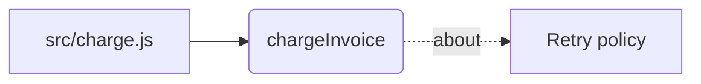

# Using the memory layer

Code says what runs. It does not say why. A function that retries twice is
readable; that a third retry existed and was removed because the payment gateway
counted it as a fresh authorisation is not in the code, and never will be.

That is what this stores, and everything below follows from it.

---

## Setup, once per project

```bash
memory init
```

Creates the store in `.memory-layer/`, probes what this platform can actually do,
and prints the result. Read that output — it is the only place that tells you
whether semantic search is real or a fallback:

```
graph              ok      ladybugdb
fts                ok      persisted-bm25
vectorSearch       ok      exact-scan
embeddings         ok      local
tokenizer          ok      unicode-fold-v3
astChunking        ok      web-tree-sitter -- 6 languages
```

`embeddings WARN hash` means the model did not load and search is running on a
lexical fallback. It still works; it just cannot match a question phrased
differently from the text. The first run downloads about 23 MB into
`<MEMORY_LAYER_HOME>/models` and takes roughly 25 seconds.

Then load the project:

```bash
memory ingest docs src
```

Re-running is cheap. Content hashes mean an unchanged file is skipped, so a
second pass over 47 files takes no time at all.

---

## Keeping it current

**Let `ingest` run itself.** The index is derived data: the files are the truth,
re-indexing is idempotent, and there is no judgement in it. The only thing that
goes wrong is letting it fall behind, and a stale index answers questions about
last week's code without saying so.

```bash
printf 'memory ingest --quiet || true\n' >> .git/hooks/post-commit
chmod +x .git/hooks/post-commit
```

Post-commit, not on save: the content has settled, nothing else holds the write
lock, and that is exactly when files changed in a way worth recording. The
`|| true` matters — a memory layer must never be able to block your commit.

**Write memories by hand.** Recording a decision is a judgement, and the reason
is the part no machine can infer:

```bash
memory write --layer semantic \
  --title "Retry twice, not exponential backoff" \
  --body "The gateway counts each attempt as a new authorisation, so backoff
          would hold customer funds twice." \
  --source-ref "docs/adr-001.md#L12-L20"
```

`--source-ref` is required. A memory you cannot trace back cannot be checked, and
will be believed anyway.

---

## The four things you will actually run

### `memory why <file|symbol>`

What the project already decided about this code. A path anchors on provenance,
a bare name anchors on the declaration:

```bash
memory why src/charge.js
memory why chargeInvoice
```

Read the `fusion` line at the bottom. `degraded: semantic` means that branch
found nothing, or was skipped — the answer came from fewer sources than it
looks.

### `memory changes`

Before committing. This is the moment memory is worth the most: not while
exploring, but just before a change lands that contradicts something somebody
already decided and wrote down.

```bash
memory changes                          # staged
memory changes --scope compare --base main
```

It also lists changed files with **nothing** recorded. That is deliberate:
"memory found nothing" and "memory was never asked" look identical if only hits
are shown.

### `memory map`

The code graph — which files declare what, and which memory is about each.

```bash
memory map                        # a tree, to read
memory map src/store              # narrowed to a path
memory map --format mermaid       # a diagram, to look at
```

The Mermaid output renders anywhere markdown does. Paste it into a README, an
issue, or any previewer:



### `memory ui`

One HTML file with everything baked in. No server, no build step — open it from
the filesystem.

```bash
memory ui                     # writes .memory-layer/ui.html
memory ui src/store           # narrowed to a path
memory ui --out graph.html    # somewhere you can mail it
```

Three tabs: a 3D graph of files, declarations and the memory about them; the
store as a filterable table; and the `doctor` report.

**It is read-only, and a snapshot.** Every write in this system is a short-lived
process, which is what lets several sessions run at once without fighting over
the store — a page holding a write connection would break exactly that. Where an
action would change something, the page gives you the command. Re-run
`memory ui` after changing the store.

The 3D view fetches its library from a CDN, so the first open needs a network.
If it cannot, the page says which of the two things went wrong instead of
showing an empty canvas — a blank graph reads as "there is nothing in here",
which is a very different and much worse message. The other tabs work either
way; their data is inline.

Above 1500 nodes it keeps the most important and says how many it dropped.
Narrow it with a path.

### `memory doctor`

What is actually working. Run it when results feel wrong, and in CI:

| Line | Meaning when it complains |
|---|---|
| `embeddings WARN hash` | The model did not load; semantic search is lexical |
| `tokenizer version FAIL` | Postings predate this build — `memory ingest --force` |
| `model drift WARN` | Stored vectors are from another model — `memory embed --force` |
| `keyword index WARN` | Some nodes are invisible to keyword search |
| `index WARN` | The index is behind HEAD — `memory ingest` |
| `journal WARN` | Writes queued behind a lock — `memory merge` |

A `FAIL` should fail your build. Every one of these describes a way search goes
quietly wrong rather than loudly broken.

---

## Forgetting

```bash
memory prune --dry-run            # what would go
memory prune                      # episodic, older than 90 days, unreferenced
memory prune --older-than 30
```

Three conditions, all required, none configurable away by accident:

- **Episodic only.** A decision does not become noise by getting old.
- **Older than the cutoff.**
- **Unreferenced.** A memory something points at is part of somebody's
  reasoning, and removing it silently breaks that chain. `prune` refuses.

Deletion removes the node, its postings, its length row, and its share of the
global averages. Doing only the first would leave a keyword index answering with
ids that resolve to nothing — no error, just wrong answers.

---

## Automatic recording, and why it is off

```bash
export MEMORY_LAYER_AUTO_RECORD=1
```

With this set, a failed shell command becomes an episodic memory — raw material
for a `RESOLVES` edge once you record the fix.

**Consider whether you want it.** It records *every* failure, and most failures
are typos. A session with a flaky test produces dozens. `prune` exists now, so
this is a decision rather than a trap, but the honest position is: turn it on
when you have a habit of pruning, not before. The value of a memory layer is
that what is in it is worth trusting.

---

## What runs on its own

Installed as a plugin, four hooks fire without you doing anything. Three of them
only read:

| When | What |
|---|---|
| Session start | Loads active constraints and unresolved conflicts |
| Before `Read`/`Grep`/`Glob` | Injects what memory knows about that file |
| Before `git commit` | Runs `changes` against the staged diff |
| After a failed `Bash` | Records it — **only** with `AUTO_RECORD=1` |

The pre-tool hook uses `--anchor-only`, which skips loading the embedding model.
That is the difference between 3.3 seconds and 0.6 on every file the agent
touches.

---

## Multiple projects

```bash
memory register     # add this project to the global registry
memory list         # every project, with index freshness
memory forget       # remove it from the registry (the store stays)
```

Search does not cross projects. That is the default and it is deliberate: memory
from a client's repository appearing in another one is an incident, not a
feature.

---

## Environment

| Variable | Does |
|---|---|
| `MEMORY_LAYER_HOME` | Registry and model cache (default `~/.memory-layer`) |
| `MEMORY_LAYER_MODEL_CACHE` | Model weights, if you need them elsewhere |
| `MEMORY_LAYER_EMBEDDINGS=hash` | Skip the model; lexical fallback only |
| `MEMORY_LAYER_AUTO_RECORD=1` | Record failed commands automatically |
| `MEMORY_LAYER_OUTPUT_BUDGET` | Byte cap on MCP tool output (default 24000) |

On Windows, keep the model cache path short. It is nested deeply by default
under pnpm, and a path over 260 characters fails as `File doesn't exist` — which
reads exactly like a blocked network and is not one.

---

## When results look wrong

1. **`memory doctor`.** Most of it is one of the rows in that table.
2. **Read the `fusion` line.** `degraded` names every branch that contributed
   nothing. Three empty branches and one weak hit is not a confident answer.
3. **Check `source_ref`.** If it points at a line that moved, the index is
   behind — `memory ingest`.
4. **Ask without accents.** Vietnamese indexes both forms, so `quyet dinh`
   finds `quyết định`. If the accented query works and the plain one does not,
   the postings are from an older tokenizer.

Memory describes what was true when it was recorded. It is context, never
current state — re-check anything you are about to act on against the tree.
