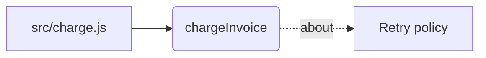

# Dùng tầng ký ức

Code nói **cái gì đang chạy**. Nó không nói **vì sao**. Một hàm thử lại hai lần
thì đọc là hiểu; còn chuyện lần thử thứ ba từng tồn tại và bị bỏ vì cổng thanh
toán đếm nó thành một lượt authorise mới thì không nằm trong code, và sẽ không
bao giờ nằm ở đó.

Đó là thứ hệ này lưu, và mọi thứ bên dưới đều suy ra từ đó.

---

## Toàn bộ luồng, một lần

```
cài plugin
        │
        ▼
memory init ──────────────────────────────────────────┐
        │  tạo .memory/                              │
        │  dò xem nền này làm được gì                │  một lệnh
        │  quét docs/ src/ README.md …               │
        │  dựng code graph (file → khai báo)         │
        │  ghi .memory/ui.html                       │
        ▼                                             ┘
mở .memory/ui.html      ← đồ thị, kho ký ức, báo cáo sức khoẻ
        │
        ▼
làm việc ── plugin tự đọc, không cần bạn nhớ gì:
        │   đầu phiên           → ràng buộc + xung đột chưa xử
        │   trước Read/Grep     → memory biết gì về file đó
        │   trước git commit    → diff đang stage chạm vào gì
        ▼
memory write ────────────── ghi một quyết định, bằng tay, kèm lý do
        │
        ▼
memory ingest ───────────── sau khi file đổi (nên đặt vào post-commit)
        │  không tham số: chọn y như init đã chọn
        │  thu hồi file không còn trên đĩa
        │  thay thế những gì file đó từng sinh ra
        │  ghi lại ui.html
        ▼
memory prune ────────────── thỉnh thoảng: dọn ghi chép episodic cũ, không ai trỏ tới
```

Hai thứ tự động, hai thứ không, và sự phân chia đó là có chủ đích.

**Đọc là tự động.** Hook nạp ngữ cảnh lúc mở phiên, trước khi đọc file, và trước
khi commit. Không phải nhớ gì.

**Đánh chỉ mục là dữ liệu dẫn xuất**, nên cho nó tự chạy là an toàn — file mới là
sự thật, chạy lại là idempotent, và cái duy nhất hỏng được là để nó lạc hậu. Đặt
`memory ingest` vào `post-commit`.

**Ghi một quyết định là phán đoán**, nên nó nằm trong tay bạn. Lý do chọn phương
án này thay vì phương án kia là phần không máy nào suy ra được, và đó cũng là
phần duy nhất đáng lưu.

**Quên cũng là phán đoán.** `memory prune` chỉ xoá ghi chép episodic cũ mà không
ai trỏ tới, và không bao giờ động vào một quyết định dù nó cũ đến đâu.

---

## Cài đặt, một lần cho mỗi dự án

```bash
memory init
```

Một lệnh. Nó tạo kho, dò xem nền này làm được gì, quét dự án, dựng code graph, và
ghi ra trang xem.

Quét bao gồm những chỗ quy ước mà một dự án hay để tài liệu, quyết định và mã
nguồn — `docs/`, `adr/`, `src/`, `lib/`, `packages/`, `README.md` và các anh em
thường gặp — rồi **báo trước** nó tìm thấy những gì, để phỏng đoán là thứ nhìn
thấy được chứ không âm thầm. Nó cố ý **không** quét `.`: quét cả repo sẽ vơ luôn
code vendor và output build, và thứ đầu tiên bạn thấy sẽ là một kho đầy rác.

```bash
memory init docs src/billing   # quét đúng những đường dẫn này
memory init --no-scan          # chỉ tạo kho, quét sau
```

Phần đáng đọc nhất là báo cáo năng lực — đây là chỗ duy nhất cho bạn biết tìm
kiếm ngữ nghĩa đang chạy thật hay đang chạy bản dự phòng:

```
graph              ok      ladybugdb
fts                ok      persisted-bm25
vectorSearch       ok      exact-scan
embeddings         ok      local
tokenizer          ok      unicode-fold-v3
astChunking        ok      web-tree-sitter -- 6 languages
```

`embeddings WARN hash` nghĩa là model không nạp được và tìm kiếm đang chạy bằng
bản dự phòng từ vựng. Vẫn dùng được, chỉ là không khớp được câu hỏi diễn đạt khác
với văn bản. Lần chạy đầu tải khoảng 23 MB vào `<MEMORY_LAYER_HOME>/models`, mất
chừng 25 giây.

Rồi mở trang nó vừa ghi:

```
.memory/ui.html
```

---

## Giữ cho nó không lạc hậu

```bash
memory ingest
```

Chạy lại rẻ: hash nội dung khiến file không đổi bị bỏ qua, lượt thứ hai trên 47
file gần như không tốn gì. Mỗi lần chạy cũng ghi lại trang xem, nên trang và kho
không bao giờ nói khác nhau.

**Sửa một file sẽ thay thế những gì nó từng sinh ra.** Id của chunk suy từ nội
dung, nên file đổi là id đổi — và cho tới khi việc này được xử lý, một file sửa
bốn lần thành **bốn node**, tất cả đều nằm trong index, tất cả cùng trả lời một
câu hỏi. Giờ bản cũ bị xoá, hoặc bị cho về hưu nếu có thứ gì trỏ tới nó: một
quyết định mà nguồn gốc dẫn tới hư vô còn tệ hơn một mảnh cũ. Báo cáo nói rõ:

```
ingested 3 files -> 12 new, 0 refreshed, 4 removed, 1 superseded
```

**Cho `ingest` tự chạy.** Chỉ mục là dữ liệu dẫn xuất: file mới là sự thật, chạy
lại là idempotent, và không có phán đoán nào trong đó. Cái duy nhất hỏng được là
để nó lạc hậu, mà chỉ mục lạc hậu thì trả lời về code tuần trước **mà không nói
gì**.

```bash
printf 'memory ingest --quiet || true\n' >> .git/hooks/post-commit
chmod +x .git/hooks/post-commit
```

Đặt ở `post-commit`, không phải mỗi lần lưu file: nội dung đã chốt, không có gì
khác đang giữ khoá ghi, và đó đúng là lúc file thay đổi một cách đáng ghi nhận.
Chữ `|| true` quan trọng — tầng ký ức **không bao giờ được phép** chặn commit
của bạn.

**Ghi ký ức bằng tay.** Ghi một quyết định là phán đoán, và lý do là phần không
máy nào suy ra được:

```bash
memory write --layer semantic \
  --title "Thử lại hai lần, không dùng exponential backoff" \
  --body "Cổng thanh toán đếm mỗi lần thử là một lượt authorise mới, nên backoff
          sẽ giữ tiền của khách hai lần." \
  --source-ref "docs/adr-001.md#L12-L20"
```

`--source-ref` là bắt buộc. Một ký ức không truy ngược được là ký ức không kiểm
chứng được, mà người ta vẫn sẽ tin nó.

---

## Cái gì được nạp

Bất cứ thứ gì là văn bản, đuôi nào cũng được và to nhỏ gì cũng được. Không có
danh sách ngôn ngữ được hỗ trợ, vì một danh sách như vậy luôn sai một chút:
danh mục của chính GitHub có khoảng một nghìn đuôi file, và bất kỳ tập con nào
tự giữ bằng tay cũng sẽ bỏ sót đúng cái ngôn ngữ dự án bạn đang dùng. Đo trên
một repo thật, danh sách cũ bỏ sót **một phần năm** số file — phần lớn là script
shell — và không nói một lời nào.

Nên câu hỏi được lật ngược. Vài danh sách ngắn nói cái gì **không** bị quét vào,
và cái nào cũng tự báo cáo:

| Không nạp | Vì sao | Muốn nạp thì làm sao |
|---|---|---|
| `.png` `.pdf` `.docx` `.zip` … | Không phải văn bản, chẳng có gì để index | Để AI đọc phân tích rồi ghi lại kết luận |
| `.env` `.pem` lockfile `*.min.js` | Bí mật và sổ sách của máy | Cố ý. Một credential không được phép chạm tới embedding |
| `.svg` `.drawio` `.puml` `.mermaid` | Bản xuất từ công cụ thiết kế / vẽ sơ đồ | `memory ingest docs/figma/tokens.svg` |
| `.csv` `.tsv` `.rtf` | Tài liệu và dữ liệu bảng | `memory ingest docs/q1.csv` |
| `node_modules` `dist` `build` `.git` … | Sinh tự động hoặc của bên thứ ba | `memory ingest docs/build` |

Markdown **không bao giờ** nằm trong mấy hàng đó. Nó chính là định dạng mà người
ta chuyển mọi thứ sang để đọc được, nên nó luôn được quét vào.

`.html`, `.xml`, `.ini`, `.cfg`, `.conf`, `.properties` cũng vậy. Một template,
một layout Android, một file config Spring là **một phần của cách hệ thống chạy**,
không phải tài liệu nói về nó — chúng là mã nguồn và được nạp như mã nguồn.

Word, Excel, PDF là **nhị phân**, nên có chỉ định đích danh cũng chẳng có gì để
index. `memory ingest report.pdf` trước đây báo `1 new, 1 embedded` rồi nhét
byte thô vào kho dưới dạng vector; giờ nó **từ chối** và chỉ sang `memory write`.
Gọi đích danh thắng được **chính sách**, không thắng được **vật lý**.

Hai hàng giữa mới là phần cần hiểu. Một bản xuất thiết kế hay một file PDF thường
không đáng lưu nguyên: thứ đáng giữ là **kết luận** ai đó rút ra từ nó, ghi bằng
`memory write` kèm `--source-ref` trỏ ngược về file. Vài nghìn mảnh toạ độ đường
vẽ không phải là kết luận. Nhưng đôi khi chính file đó là tài liệu tham chiếu, và
**gọi đích danh thì luôn thắng** — thắng luật này, thắng danh sách chặn thư mục,
và thắng cả ngưỡng dung lượng.

Mọi lần bỏ qua đều được in ra kèm lý do và kèm đường thoát:

```
ingested 12 files (0 unchanged) -> 12 new, 12 embedded
skipped 4:
   2 not text (.pdf .png)
      nothing to index; read it with an agent and record the conclusion
   1 not indexed unless named (.svg)
      name the file to index it anyway
   1 excluded directory (build)
      name the directory to index it anyway
   --verbose to list them
```

Bỏ qua là một quyết định hợp lý. Bỏ qua **trong im lặng** mới là cách một kho
ký ức trở nên vừa được tin vừa thiếu sót.

### Dung lượng

Mã nguồn và văn bản **không bao giờ** bị từ chối vì lớn. Một module lớn là một
phần lớn của dự án, và một tầng âm thầm từ chối index những file lớn nhất thì tệ
hơn một tầng chạy hơi lâu.

Chi phí là thật, và nó tính bằng **số chunk chứ không phải số byte** — hai thứ
này lệch nhau rất xa. Đo được: 3 MB văn bản thành 3 444 chunk, còn 300 KB mã
nguồn dày đặc khai báo thành **7 494** chunk, vì chunker cắt theo biên khai báo.
File nào đẻ ra số chunk bất thường sẽ được **nêu tên** trong báo cáo chứ không bị
từ chối — vì từ đây nhìn vào, một API client sinh tự động và một module lõi viết
tay trông y hệt nhau, chỉ bạn mới biết cái nào là cái nào.

## Bốn thứ bạn thực sự sẽ chạy

### `memory why <file|symbol>`

Dự án đã quyết gì về đoạn code này. Đường dẫn thì neo theo nguồn gốc, tên trần
thì neo theo khai báo:

```bash
memory why src/charge.js
memory why chargeInvoice
```

Đọc dòng `fusion` ở cuối. `degraded: semantic` nghĩa là nhánh đó không tìm ra gì,
hoặc bị bỏ qua — câu trả lời đến từ ít nguồn hơn vẻ ngoài của nó.

### `memory changes`

Trước khi commit. Đây là lúc ký ức đáng giá nhất: không phải lúc khám phá, mà
đúng ngay trước khi một thay đổi hạ cánh và mâu thuẫn với thứ ai đó đã quyết và
đã ghi lại.

```bash
memory changes                          # đang stage
memory changes --scope compare --base main
```

Nó cũng liệt kê những file **không** có gì được ghi nhận. Đó là cố ý: "memory
không tìm thấy gì" và "chưa ai hỏi memory" mà chỉ hiện phần tìm thấy thì nhìn
giống hệt nhau.

### `memory map`

Code graph — file nào khai báo gì, và ký ức nào nói về từng cái.

```bash
memory map                        # dạng cây, để đọc
memory map src/store              # thu hẹp theo đường dẫn
memory map --format mermaid       # sơ đồ, để nhìn
```

Bản Mermaid render được ở bất cứ đâu markdown chạy. Dán vào README, vào issue,
hay bất kỳ trình xem nào:



### `memory ui`

Một file HTML, dữ liệu nhúng sẵn. Không server, không bước build — mở thẳng từ ổ
đĩa.

```bash
memory ui                     # ghi .memory/ui.html
memory ui src/store           # thu hẹp theo đường dẫn
memory ui --out graph.html    # chỗ nào tiện gửi cho người khác
```

**Nó sinh ra lúc nào:** `memory init` ghi nó, và mọi lần `ingest` hay `prune` có
thay đổi gì đều ghi lại. Bạn hiếm khi phải gõ `memory ui` — lệnh đó để xem một
phần thu hẹp, hoặc để lấy một bản gửi cho ai đó.

**Reload trình duyệt có cập nhật không? Không, và không thể.** Dữ liệu được nhúng
cứng vào file. Trình duyệt **từ chối `fetch` qua `file://`**, nên trang mở từ ổ
đĩa không đọc được file dữ liệu nằm cạnh nó; nhúng inline là cách duy nhất để
trang chạy mà không cần server, và điều đó biến nó thành một **ảnh chụp**. Bấm
refresh chỉ ra đúng ảnh chụp cũ — thứ làm mới nó là lần `ingest` kế tiếp. Phần
đầu trang có ghi thời điểm dựng, để bạn biết thứ mình đang nhìn cũ tới đâu.

`--no-ui` bỏ qua bước ghi lại cho lệnh nào không muốn trả cái giá đó, khoảng
600 ms trên kho 638 node.

Ba tab: đồ thị 3D gồm file, khai báo và ký ức về chúng; kho ký ức dạng bảng lọc
được; và báo cáo `doctor`.

Click **bất kỳ node nào** cũng mở ra thứ nó nói về — một khai báo trả lời bằng ký
ức ghi nhận cho nó, một file trả lời bằng mọi ký ức của các khai báo trong đó
cộng thêm những gì ghi thẳng vào đường dẫn. Click không ra gì thì **nói ra** chứ
không im lặng.

Nền sáng mặc định. Nút ở đầu trang đổi sang tối và nhớ lựa chọn; nó **không** đi
theo hệ điều hành, vì làm vậy sẽ trả trang tối cho người vốn muốn trang trắng.

**Trang chỉ đọc, và là ảnh chụp.** Mọi lệnh ghi trong hệ này là tiến trình ngắn
hạn — đó là thứ cho phép nhiều phiên chạy cùng lúc mà không tranh kho; một trang
giữ kết nối ghi sẽ phá đúng tính chất đó. Chỗ nào cần thay đổi, trang đưa bạn câu
lệnh.

Phần 3D tải thư viện từ CDN, nên lần mở đầu tiên cần mạng. Nếu không tải được,
trang **nói rõ hỏng ở đâu** thay vì hiện canvas trắng — đồ thị trắng đọc thành
"trong này không có gì", một thông điệp khác hẳn và tệ hơn nhiều. Hai tab kia dữ
liệu nằm inline nên chạy bình thường.

Trên 1500 node, nó giữ phần quan trọng nhất và **nói đã bỏ bao nhiêu**. Thu hẹp
bằng đường dẫn.

### `memory doctor`

Cái gì đang thực sự chạy. Chạy khi kết quả có vẻ sai, và chạy trong CI:

| Dòng | Nghĩa là gì khi nó kêu |
|---|---|
| `embeddings WARN hash` | Model không nạp được; tìm kiếm ngữ nghĩa đang là từ vựng |
| `tokenizer version FAIL` | Postings cũ hơn bản build này — `memory ingest --force` |
| `model drift WARN` | Vector đã lưu thuộc model khác — `memory embed --force` |
| `keyword index WARN` | Một số node vô hình với tìm kiếm từ khoá |
| `index WARN` | Chỉ mục lùi sau HEAD — `memory ingest` |
| `journal WARN` | Lệnh ghi đang xếp hàng sau khoá — `memory merge` |

Một dòng `FAIL` nên làm đỏ build của bạn. Mỗi dòng ở đây đều mô tả một kiểu tìm
kiếm **sai âm thầm**, không phải hỏng ồn ào.

---

## Quên

```bash
memory prune --dry-run            # xem trước cái gì sẽ đi
memory prune                      # episodic, cũ hơn 90 ngày, không ai trỏ tới
memory prune --older-than 30
```

Ba điều kiện, bắt buộc cả ba, không cái nào lỡ tay tắt được:

- **Chỉ episodic.** Một quyết định không thành rác vì nó cũ.
- **Cũ hơn ngưỡng.**
- **Không ai trỏ tới.** Ký ức có thứ trỏ tới nó là một mắt xích trong lập luận
  của ai đó, xoá đi là cắt đứt mắt xích ấy trong im lặng. `prune` từ chối.

Xoá là xoá node, postings của nó, dòng độ dài, và phần của nó trong các số liệu
trung bình. Chỉ làm việc đầu tiên sẽ để lại một chỉ mục từ khoá trả về id không
resolve được — không lỗi nào, chỉ là trả lời sai.

---

## Ghi tự động, và vì sao nó đang tắt

```bash
export MEMORY_LAYER_AUTO_RECORD=1
```

Bật lên thì một lệnh shell thất bại sẽ thành ký ức `episodic` — nguyên liệu cho
cạnh `RESOLVES` khi bạn ghi lại cách sửa.

**Cân nhắc xem bạn có muốn không.** Nó ghi **mọi** lần thất bại, mà phần lớn thất
bại là gõ nhầm. Một phiên có test chập chờn sinh ra vài chục cái. Giờ đã có
`prune` nên đây là một lựa chọn chứ không còn là cái bẫy, nhưng nói thẳng thì:
bật khi bạn đã có thói quen prune, đừng bật trước. Giá trị của tầng ký ức nằm ở
chỗ **thứ trong đó đáng tin**.

---

## Cái gì tự chạy

Cài dưới dạng plugin, bốn hook chạy mà không cần bạn làm gì. Ba trong số đó chỉ
đọc:

| Khi nào | Làm gì |
|---|---|
| Đầu phiên | Nạp ràng buộc đang hiệu lực và xung đột chưa xử |
| Trước `Read`/`Grep`/`Glob` | Bơm những gì memory biết về file đó |
| Trước `git commit` | Chạy `changes` trên diff đang stage |
| Sau khi `Bash` thất bại | Ghi lại — **chỉ khi** có `AUTO_RECORD=1` |

Hook trước-tool dùng `--anchor-only`, tức bỏ qua việc nạp model nhúng. Đó là
khác biệt giữa 3,3 giây và 0,6 giây trên **mỗi** file agent đụng vào.

---

### Hook tiêu bao nhiêu

Trước đây giới hạn là **số mục** — ba. Ba mục có thể là 60 token hoặc 6 000
token tuỳ người ta viết dài hay ngắn, nên cùng một con số mà chi phí lệch trăm
lần — và nó **không bao giờ nói đã bỏ lại gì**. Chín ký ức về một file, hiển thị
ba, sáu cái kia biến mất không dấu vết — ngay trong đường chạy nhiều nhất, tức
là trên mọi Read, Grep và Glob.

Giờ cả hai hook tiêu theo **ngân sách token** và báo cáo phần còn lại:

```
Project memory has 9 entries about src/charge.js, showing 3:
- [semantic] Chốt ở hai lần, không backoff (docs/adr-001.md#L12-L20)
- [decision] ...
- [episodic] ...
6 more not shown: memory_why src/charge.js
```

| Biến | Mặc định | Áp cho |
|---|---|---|
| `MEMORY_LAYER_HOOK_TOKENS` | 400 | Trước Read, Grep, Glob |
| `MEMORY_LAYER_SESSION_TOKENS` | 700 | Ràng buộc lúc mở phiên |

Hai tính chất quan trọng hơn con số. **Mục đầu tiên luôn được giữ** dù dài đến
đâu — vì một ngân sách có thể trả về rỗng sẽ biến một ký ức quá khổ thành câu
"file này không có ghi chép nào", tức là ngược hẳn sự thật. Và **file không có
gì ghi thì hook vẫn im hoàn toàn**, nên chi phí luôn tỉ lệ với mức hữu ích.

`memory search` và `memory why` giờ trả thêm `total` và `omitted` trong `--json`
vì cùng lý do đó. `memory changes` đã báo số bỏ sót từ ngày nó được viết; đúng
hai lệnh mà hook gọi thì lại không.

## Nhiều dự án

```bash
memory register     # thêm dự án này vào registry chung
memory list         # mọi dự án, kèm độ tươi của chỉ mục
memory forget       # bỏ khỏi registry (kho vẫn còn)
```

Tìm kiếm **không** đi xuyên dự án. Đó là mặc định và là cố ý: ký ức từ repo của
một khách hàng xuất hiện trong repo khác là một sự cố, không phải tính năng.

---

## Biến môi trường

| Biến | Tác dụng |
|---|---|
| `MEMORY_LAYER_HOME` | Registry và cache model (mặc định `~/.memory-layer`) |
| `MEMORY_LAYER_MODEL_CACHE` | Trọng số model, nếu bạn cần để chỗ khác |
| `MEMORY_LAYER_EMBEDDINGS=hash` | Bỏ qua model; chỉ dùng bản dự phòng từ vựng |
| `MEMORY_LAYER_AUTO_RECORD=1` | Tự ghi lệnh thất bại |
| `MEMORY_LAYER_OUTPUT_BUDGET` | Trần byte cho output tool MCP (mặc định 24000) |
| `MEMORY_LAYER_HOOK_TOKENS` | Ngân sách token trước Read/Grep/Glob (mặc định 400) |
| `MEMORY_LAYER_SESSION_TOKENS` | Ngân sách token cho ràng buộc đầu phiên (mặc định 700) |

Trên Windows, giữ đường dẫn cache model **ngắn**. Mặc định nó nằm sâu dưới pnpm,
và đường dẫn quá 260 ký tự sẽ hỏng với thông báo `File doesn't exist` — đọc y hệt
như mạng bị chặn, mà không phải vậy.

---

## Khi kết quả có vẻ sai

1. **`memory doctor`.** Phần lớn nằm ở một trong các dòng của bảng trên.
2. **Đọc dòng `fusion`.** `degraded` gọi tên mọi nhánh không đóng góp gì. Ba
   nhánh rỗng và một kết quả yếu thì không phải câu trả lời chắc chắn.
3. **Kiểm `source_ref`.** Nếu nó trỏ vào dòng đã dịch chuyển thì chỉ mục lạc hậu
   — chạy `memory ingest`.
4. **Thử hỏi không dấu.** Tiếng Việt được đánh chỉ mục cả hai dạng, nên
   `quyet dinh` tìm ra `quyết định`. Nếu câu có dấu chạy mà câu không dấu không
   chạy, postings đang thuộc tokenizer đời cũ.

Ký ức mô tả điều đã đúng **vào lúc nó được ghi**. Nó là ngữ cảnh, không bao giờ
là hiện trạng — thứ gì bạn sắp hành động dựa trên nó thì kiểm lại với cây mã
nguồn trước.
